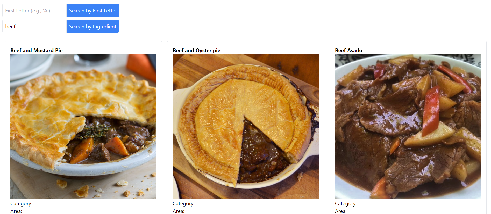

<a name="readme-top"></a>

<!-- PROJECT SHIELDS -->
[![Contributors][contributors-shield]][contributors-url]
[![Forks][forks-shield]][forks-url]
[![Stargazers][stars-shield]][stars-url]
[![Issues][issues-shield]][issues-url]
[![MIT License][license-shield]][license-url]

<!-- TABLE OF CONTENTS -->
<details>
  <summary>Table of Contents</summary>
  <ol>
    <li><a href="#about-the-project">About The Project</a></li>
    <li>
      <a href="#getting-started">Getting Started</a>
      <ul>
        <li><a href="#prerequisites">Prerequisites</a></li>
        <li><a href="#installation">Installation</a></li>
      </ul>
    </li>
    <li><a href="#usage">Usage</a></li>
    <li><a href="#roadmap">Roadmap</a></li>
    <li><a href="#contributing">Contributing</a></li>
    <li><a href="#license">License</a></li>
    <li><a href="#contact">Contact</a></li>
    <li><a href="#acknowledgments">Acknowledgments</a></li>
  </ol>
</details>

<!-- ABOUT THE PROJECT -->
## About The Project



The Recipe Finder App Client is a React-based frontend application designed to help users easily search and view various recipes. It integrates with an external recipe API and provides functionalities like searching by name, ingredient, or random selection.

### Built With

* [React.js](https://reactjs.org/)
* [Next.js](https://nextjs.org/)
* [Tailwind CSS](https://tailwindcss.com/)


<!-- GETTING STARTED -->
## Getting Started

To get a local copy up and running follow these simple steps.

### Prerequisites

* npm
  ```sh
  npm install npm@latest -g
  ```

### Installation

1. Clone the repo
   ```sh
   git clone https://github.com/your_username_/recipe-finder-app.git
   ```
2. Navigate to the client directory
   ```sh
   cd recipe-finder-app/client
   ```
3. Install NPM packages
   ```sh
   npm install
   ```

<!-- USAGE EXAMPLES -->
## Usage

Use this project to search for various recipes, view detailed recipe information, and get inspired for your next meal.


<!-- ROADMAP -->
## Roadmap

- [ ] Implement recipe saving and management features
- [ ] Integrate more recipe APIs
- [ ] Add user feedback and rating system
- [ ] Expand the test suite
- [ ] Multi-language Support
    - [ ] Mandarin
    - [ ] Japanese
    - [ ] Korean
    - [ ] Russian
    - [ ] German
    - [ ] Spanish
    - [ ] Arabic

See the [open issues](https://github.com/issues) for a full list of proposed features (and known issues).

<!-- CONTRIBUTING -->
## Contributing

Contributions are what make the open source community such an amazing place to learn, inspire, and create. Any contributions you make are **greatly appreciated**.

If you have a suggestion that would make this better, please fork the repo and create a pull request. You can also simply open an issue with the tag "enhancement".
Don't forget to give the project a star! Thanks again!

1. Fork the Project
2. Create your Feature Branch (`git checkout -b feature/AmazingFeature`)
3. Commit your Changes (`git commit -m 'Add some AmazingFeature'`)
4. Push to the Branch (`git push origin feature/AmazingFeature`)
5. Open a Pull Request

<!-- LICENSE -->
## License

Distributed under the MIT License. 

<!-- CONTACT -->
## Contact

Sheneeza Volcov - [@your_twitter](https://twitter.com/your_username) - thepolyglot8@gmail.com

Project Link: [https://github.com/your_username/repo_name](https://github.com/your_username/repo_name)


<!-- ACKNOWLEDGMENTS -->
## Acknowledgments

* [React Icons](https://react-icons.github.io/react-icons/search)
* [Tailwind CSS](https://tailwindcss.com/)


<p align="right">(<a href="#readme-top">back to top</a>)</p>